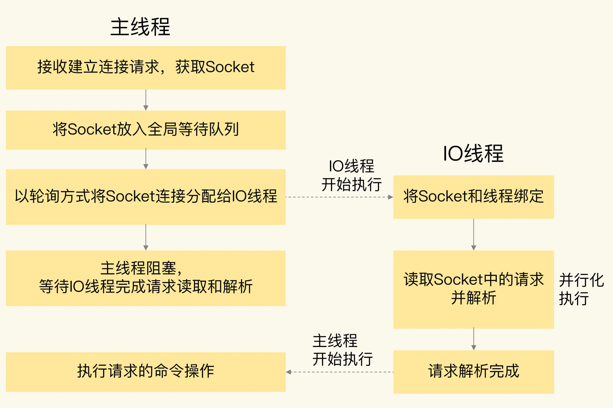
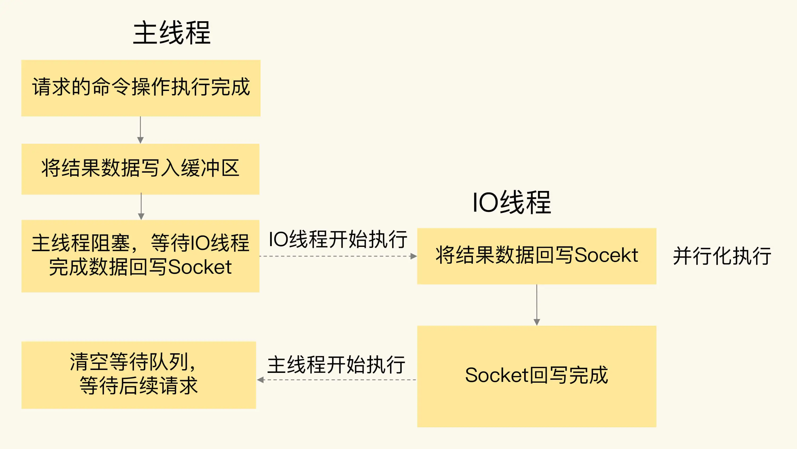

# redis 6.0 新特性
## 面向网络处理的多IO线程
面向网络处理的多IO线程可以提供网络请求的处理速度
### 为何引入多线程特性
从网络IO处理到实际的读写命令处理，都是有单线程完成的。随着网络硬件性能的提升，Redis的性能瓶颈有时会出现在网络IO的处理上，即单个线程处理网络请求的速度跟不上底层网络硬件的速度。

### 单个线程处理网络请求的速度跟不上底层网络硬件的速度，解决方案有那些？
- 1、用用户态网络协议栈（例如 DPDK）取代内核网络协议栈，让网络请求的处理不用在内核里执行，直接在用户态完成处理就行。
  - 对于高性能的 Redis 来说，避免频繁让内核进行网络请求处理，可以很好地提升请求处理效率。但是，这个方法要求在 Redis 的整体架构中，添加对用户态网络协议栈的支持，需要修改 Redis 源码中和网络相关的部分（例如修改所有的网络收发请求函数），这会带来很多开发工作量。而且新增代码还可能引入新 Bug，导致系统不稳定。所以，Redis 6.0 中并没有采用这个方法。
- 2、采用多个 IO 线程来处理网络请求，提高网络请求处理的并行度。Redis 6.0 就是采用的这种方法。
  - Redis 的多 IO 线程只是用来处理网络请求的，对于读写命令，Redis 仍然使用单线程来处理。这是因为，Redis 处理请求时，网络处理经常是瓶颈，通过多个 IO 线程并行处理网络操作，可以提升实例的整体处理性能。而继续使用单线程执行命令操作，就不用为了保证 Lua 脚本、事务的原子性，额外开发多线程互斥机制了。这样一来，Redis 线程模型实现就简单了。
### Redis 6.0 中，主线程和 IO 线程具体是怎么协作完成请求处理的
- 1.服务端和客户端建立 Socket 连接，并分配处理线程
  - 主线程负责接收建立连接请求。当有客户端请求和实例建立 Socket 连接时，主线程会创建和客户端的连接，并把 Socket 放入全局等待队列中。紧接着，主线程通过轮询方法把 Socket 连接分配给 IO 线程。
- 2.IO 线程读取并解析请求
  - 主线程一旦把 Socket 分配给 IO 线程，就会进入阻塞状态，等待 IO 线程完成客户端请求读取和解析。因为有多个 IO 线程在并行处理，所以，这个过程很快就可以完成。
- 3.主线程执行请求操作
  - 等到IO 线程解析完请求，主线程还是会以单线程的方式执行这些命令操作
  - 
- 4.IO 线程回写 Socket 和主线程清空全局队列
  - 当主线程执行完请求操作后，会把需要返回的结果写入缓冲区，然后，主线程会阻塞等待 IO 线程把这些结果回写到 Socket 中，并返回给客户端。
  - 和 IO 线程读取和解析请求一样，IO 线程回写 Socket 时，也是有多个线程在并发执行，所以回写 Socket 的速度也很快。等到 IO 线程回写 Socket 完毕，主线程会清空全局队列，等待客户端的后续请求。
  - 
### 开启方式
- 6.0多线程机制默认是关闭
- 开启方式（redis.conf）
  - 1、设置io-thread-do-reads 配置项为yes，表示启用多线程
  - 2、设置线程个数。一般来说，线程个数要小于redis实例所在机器的cpu核个数，例如，对于一个 8 核的机器来说，Redis 官方建议配置 6 个 IO 线程。
    - io-threads 6
## 客户端缓存
Redis 6.0 新增了一个重要的特性，就是实现了服务端协助的客户端缓存功能，也称为跟踪（Tracking）功能。有了这个功能，业务应用中的 Redis 客户端就可以把读取的数据缓存在业务应用本地了，应用就可以直接在本地快速读取数据了。
### 数据一致性问题
- 如果数据被修改了或是失效了，如何通知客户端对缓存的数据做失效处理？
- 2中模式
  - 第一种模式是普通模式。在这个模式下，实例会在服务端记录客户端读取过的 key，并监测 key 是否有修改。一旦 key 的值发生变化，服务端会给客户端发送 invalidate 消息，通知客户端缓存失效了。
    - 注意
      - 服务端对于记录的 key 只会报告一次 invalidate 消息，也就是说，服务端在给客户端发送过一次 invalidate 消息后，如果 key 再被修改，此时，服务端就不会再次给客户端发送 invalidate 消息。
      - 只有当客户端再次执行读命令时，服务端才会再次监测被读取的 key，并在 key 修改时发送 invalidate 消息。这样设计的考虑是节省有限的内存空间。毕竟，如果客户端不再访问这个 key 了，而服务端仍然记录 key 的修改情况，就会浪费内存资源。
      - CLIENT TRACKING ON|OFF
  - 第二种模式是广播模式。在这个模式下，服务端会给客户端广播所有 key 的失效情况，不过，这样做了之后，如果 key 被频繁修改，服务端会发送大量的失效广播消息，这就会消耗大量的网络带宽资源。
    - 在实际应用时，我们会让客户端注册希望跟踪的 key 的前缀，当带有注册前缀的 key 被修改时，服务端会把失效消息广播给所有注册的客户端。和普通模式不同，在广播模式下，即使客户端还没有读取过 key，但只要它注册了要跟踪的 key，服务端都会把 key 失效消息通知给这个客户端。
  - 普通模式和广播模式需要客户端使用 RESP 3 协议，RESP 3 协议是 6.0 新启用的通信协议
  - 对于使用 RESP 2 协议的客户端来说，就需要使用另一种模式，也就是重定向模式（redirect）。在重定向模式下，想要获得失效消息通知的客户端，就需要执行订阅命令 SUBSCRIBE，专门订阅用于发送失效消息的频道 _redis_:invalidate。同时，再使用另外一个客户端，执行 CLIENT TRACKING 命令，设置服务端将失效消息转发给使用 RESP 2 协议的客户端。
## 细类度的权限控制
- 6.0 版本支持创建不同用户来使用 Redis
- 6.0 版本还支持以用户为粒度设置命令操作的访问权限。
## RESP3协议的使用
- Redis 6.0 实现了 RESP 3 通信协议，而之前都是使用的 RESP 2。在 RESP 2 中，客户端和服务器端的通信内容都是以字节数组形式进行编码的，客户端需要根据操作的命令或是数据类型自行对传输的数据进行解码，增加了客户端开发复杂度。
- RESP 3 直接支持多种数据类型的区分编码，包括空值、浮点数、布尔值、有序的字典集合、无序的集合等。
- 区分编码，就是指直接通过不同的开头字符，区分不同的数据类型，这样一来，客户端就可以直接通过判断传递消息的开头字符，来实现数据转换操作了，提升了客户端的效率。除此之外，RESP 3 协议还可以支持客户端以普通模式和广播模式实现客户端缓存。

## Redis 6.0 的哪些新特性帮助最大？
- 多 IO 线程可以让 Redis 在并发量非常大时，让其性能再上一个台阶，性能提升近 1 倍，对于单机 Redis 性能要求更高的业务场景，非常有帮助。
- 客户端缓存可以让 Redis 的数据缓存在客户端，相当于每个应用进程多了一个本地缓存，Redis 数据没有变化时，业务直接在应用进程内就能拿到数据，这不仅节省了网络带宽，降低了 Redis 的请求压力，还充分利用了业务应用的资源，对应用性能的提升也非常大。