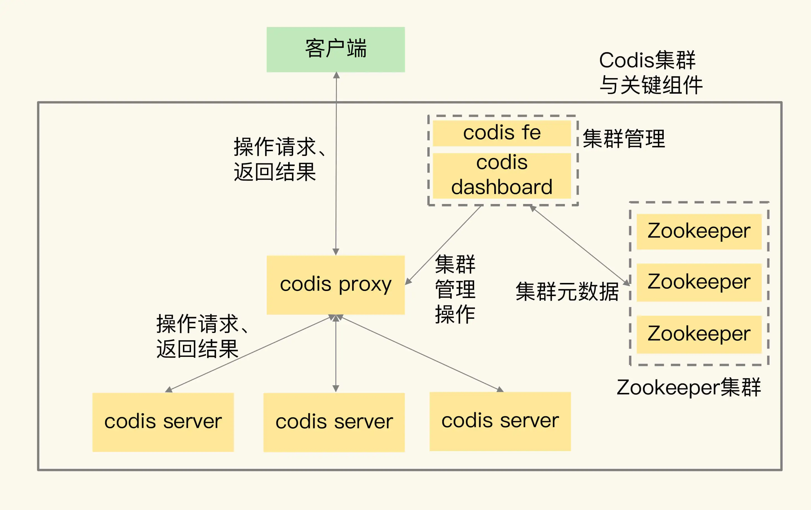
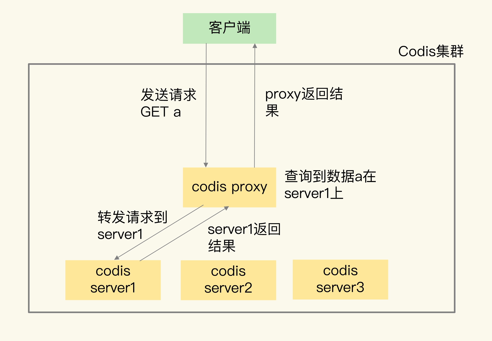
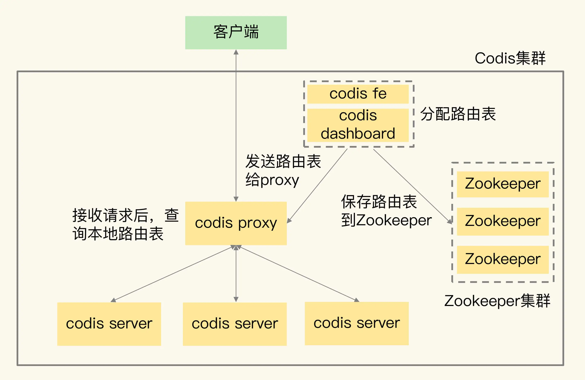

# Codis
## Codis集群主要组件
- codis server：这是进行了二次开发的 Redis 实例，其中增加了额外的数据结构，支持数据迁移操作，主要负责处理具体的数据读写请求。
- codis proxy：接收客户端请求，并把请求转发给 codis server
- Zookeeper 集群：保存集群元数据，例如数据位置信息和 codis proxy 信息。
- codis dashboard 和 codis fe：共同组成了集群管理工具
  - codis dashboard 负责执行集群管理工作，包括增删 codis server、codis proxy 和进行数据迁移
  - codis fe 负责提供 dashboard 的 Web 操作界面，便于我们直接在 Web 界面上进行集群管理
## 架构图

## Codis请求处理流程
- 1、为了让集群能接收并处理请求，我们要先使用 codis dashboard 设置 codis server 和 codis proxy 的访问地址，完成设置后，codis server 和 codis proxy 才会开始接收连接。
- 2、当客户端要读写数据时，客户端直接和 codis proxy 建立连接。
  - codis proxy 本身支持 Redis 的 RESP 交互协议，所以，客户端访问 codis proxy 时，和访问原生的 Redis 实例没有什么区别，这样一来，原本连接单实例的客户端就可以轻松地和 Codis 集群建立起连接了
- 3、codis proxy 接收到请求，就会查询请求数据和 codis server 的映射关系，并把请求转发给相应的 codis server 进行处理。当 codis server 处理完请求后，会把结果返回给 codis proxy，proxy 再把数据返回给客户端

### 流程图

## 分片集群关键技术因素
数据分布、集群扩容和数据迁移、客户端兼容性、可靠性保证

### 数据如何在集群分布
- 在 Codis 集群中，一个数据应该保存在哪个 codis server 上，这是通过逻辑槽（Slot）映射来完成的，具体来说，总共分成两步。
  - 1、Codis 集群一共有 1024 个 Slot，编号依次是 0 到 1023。我们可以把这些 Slot 手动分配给 codis server，每个 server 上包含一部分 Slot。当然，我们也可以让 codis dashboard 进行自动分配，例如，dashboard 把 1024 个 Slot 在所有 server 上均分。
  - 2、当客户端要读写数据时，会使用 CRC32 算法计算数据 key 的哈希值，并把这个哈希值对 1024 取模。而取模后的值，则对应 Slot 的编号。此时，根据第一步分配的 Slot 和 server 对应关系，我们就可以知道数据保存在哪个 server 上了。
  - Slot 和 codis server 的映射关系称为数据路由表（简称路由表）。我们在 codis dashboard 上分配好路由表后，dashboard 会把路由表发送给 codis proxy，同时，dashboard 也会把路由表保存在 Zookeeper 中。codis-proxy 会把路由表缓存在本地，当它接收到客户端请求后，直接查询本地的路由表，就可以完成正确的请求转发了。
  - 路由表的分配和使用过程
    - 
  - 与Redis Cluster的区别
    - 1、Codis 中的路由表是我们通过 codis dashboard 分配和修改的，并被保存在 Zookeeper 集群中。一旦数据位置发生变化（例如有实例增减），路由表被修改了，codis dashbaord 就会把修改后的路由表发送给 codis proxy，proxy 就可以根据最新的路由信息转发请求了。
    - 2、在 Redis Cluster 中，数据路由表是通过每个实例相互间的通信传递的，最后会在每个实例上保存一份。当数据路由信息发生变化时，就需要在所有实例间通过网络消息进行传递。所以，如果实例数量较多的话，就会消耗较多的集群网络资源。
### 集群扩容和数据迁移如何进行?
#### 扩容
- Codis 集群扩容包括了两方面：增加 codis server 和增加 codis proxy。
  - 1、启动新的 codis server，将它加入集群；
  - 2、把部分数据迁移到新的 server。

#### 迁移
- Codis 集群按照 Slot 的粒度进行数据迁移
  - 1、在源 server 上，Codis 从要迁移的 Slot 中随机选择一个数据，发送给目的 server。
  - 2、目的 server 确认收到数据后，会给源 server 返回确认消息。这时，源 server 会在本地将刚才迁移的数据删除。
  - 3、第一步和第二步就是单个数据的迁移过程。Codis 会不断重复这个迁移过程，直到要迁移的 Slot 中的数据全部迁移完成。
- Codis迁移模式
  - 同步迁移是指，在数据从源 server 发送给目的 server 的过程中，源 server 是阻塞的，无法处理新的请求操作。这种模式很容易实现，但是迁移过程中会涉及多个操作（包括数据在源 server 序列化、网络传输、在目的 server 反序列化，以及在源 server 删除），如果迁移的数据是一个 bigkey，源 server 就会阻塞较长时间，无法及时处理用户请求。
  - 为了避免数据迁移阻塞源 server，Codis 实现的第二种迁移模式就是异步迁移。异步迁移的关键特点有两个。
    - 第一个特点是，当源 server 把数据发送给目的 server 后，就可以处理其他请求操作了，不用等到目的 server 的命令执行完。而目的 server 会在收到数据并反序列化保存到本地后，给源 server 发送一个 ACK 消息，表明迁移完成。此时，源 server 在本地把刚才迁移的数据删除。 在这个过程中，迁移的数据会被设置为只读，所以，源 server 上的数据不会被修改，自然也就不会出现“和目的 server 上的数据不一致”的问题了。
    - 第二个特点是，对于 bigkey，异步迁移采用了拆分指令的方式进行迁移。具体来说就是，对 bigkey 中每个元素，用一条指令进行迁移，而不是把整个 bigkey 进行序列化后再整体传输。这种化整为零的方式，就避免了 bigkey 迁移时，因为要序列化大量数据而阻塞源 server 的问题。
      - 此外，当 bigkey 迁移了一部分数据后，如果 Codis 发生故障，就会导致 bigkey 的一部分元素在源 server，而另一部分元素在目的 server，这就破坏了迁移的原子性。
      - 所以，Codis 会在目标 server 上，给 bigkey 的元素设置一个临时过期时间。如果迁移过程中发生故障，那么，目标 server 上的 key 会在过期后被删除，不会影响迁移的原子性。当正常完成迁移后，bigkey 元素的临时过期时间会被删除。
  - 通过异步迁移命令 SLOTSMGRTTAGSLOT-ASYNC 的参数 numkeys 设置每次迁移的 key 数量。

### 集群客户端需要重新开发吗?
- 使用 Redis 单实例时，客户端只要符合 RESP 协议，就可以和实例进行交互和读写数据。但是，在使用切片集群时，有些功能是和单实例不一样的，比如集群中的数据迁移操作，在单实例上是没有的，而且迁移过程中，数据访问请求可能要被重定向（例如 Redis Cluster 中的 MOVE 命令）
- 客户端需要增加和集群功能相关的命令操作的支持。如果原来使用单实例客户端，想要扩容使用集群，就需要使用新客户端，这对于业务应用的兼容性来说，并不是特别友好。
- Codis 集群在设计时，就充分考虑了对现有单实例客户端的兼容性。
  - Codis 使用 codis proxy 直接和客户端连接，codis proxy 是和单实例客户端兼容的。而和集群相关的管理工作（例如请求转发、数据迁移等），都由 codis proxy、codis dashboard 这些组件来完成，不需要客户端参与。
  - 这样一来，业务应用使用 Codis 集群时，就不用修改客户端了，可以复用和单实例连接的客户端，既能利用集群读写大容量数据，又避免了修改客户端增加复杂的操作逻辑，保证了业务代码的稳定性和兼容性。
### 集群可靠性问题
- 对于一个分布式系统来说，它的可靠性和系统中的组件个数有关：组件越多，潜在的风险点也就越多。
- codis server
  - codis server 其实就是 Redis 实例，只不过增加了和集群操作相关的命令。Redis 的主从复制机制和哨兵机制在 codis server 上都是可以使用的，所以，Codis 就使用主从集群来保证 codis server 的可靠性。
  - 

### 假设 Codis 集群中保存的 80% 的键值对都是 Hash 类型，每个 Hash 集合的元素数量在 10 万 ～ 20 万个，每个集合元素的大小是 2KB。迁移一个这样的 Hash 集合数据，是否会对 Codis 的性能造成影响？
不会有性能影响。
Codis 在迁移数据时，设计的方案可以保证迁移性能不受影响。
- 1、异步迁移：源节点把迁移的数据发送给目标节点后就返回，之后接着处理客户端请求，这个阶段不会长时间阻塞源节点。目标节点加载迁移的数据成功后，向源节点发送 ACK 命令，告知其迁移成功。
- 2、源节点异步释放 key：源节点收到目标节点 ACK 后，在源实例删除这个 key，释放 key 内存的操作，会放到后台线程中执行，不会阻塞源实例。（没错，Codis 比 Redis 更早地支持了 lazy-free，只不过只用在了数据迁移中）。
- 3、小对象序列化传输：小对象依旧采用序列化方式迁移，节省网络流量。
- 4、bigkey 分批迁移：bigkey 拆分成一条条命令，打包分批迁移（利用了 Pipeline 的优势），提升迁移速度。
- 5、一次迁移多个 key：一次发送多个 key 进行迁移，提升迁移效率。
- 6、迁移流量控制：迁移时会控制缓冲区大小，避免占满网络带宽。
- 7、bigkey 迁移原子性保证（兼容迁移失败情况）：迁移前先发一个 DEL 命令到目标节点（重试可保证幂等性），然后把 bigkey 拆分成一条条命令，并设置一个临时过期时间（防止迁移失败在目标节点遗留垃圾数据），迁移成功后在目标节点设置真实的过期时间。

Codis 在数据迁移方面要比 Redis Cluster 做得更优秀，而且 Codis 还带了一个非常友好的运维界面，方便 DBA 执行增删节点、主从切换、数据迁移等操作。
我当时在对 Codis 开发新的组件时，被 Codis 的优秀设计深深折服。当然，它的缺点也很明显，组件比较多，部署略复杂。另外，因为是基于 Redis 3.2.8 做的二次开发，所以升级 Redis Server 比较困难，新特性也就自然无法使用。
现在 Codis 已经不再维护，但是作为国人开发的 Redis 集群解决方案，其设计思想还是非常值得学习的。也推荐 Go 开发者，读一读 Codis 源码，质量非常高，对于 Go 语言的进阶也会有很大收获！