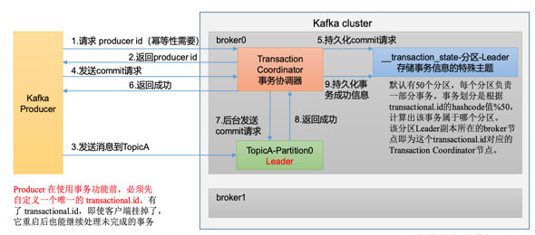
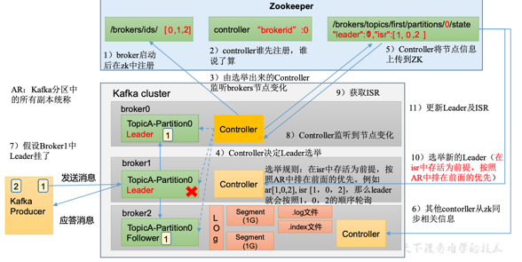
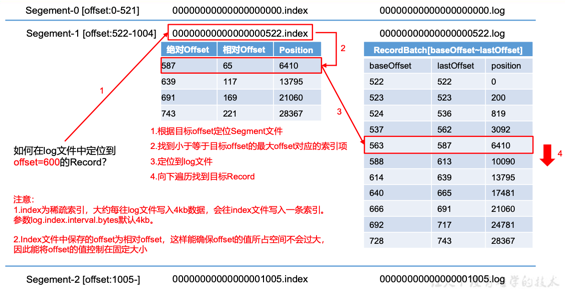

# kafka 定义
- 传统定义：分布式的基于发布/订阅模式的消息队列，主要用于大数据实时处理领域
- 最新定义：是一个开源的分布式事件流平台，被数千家公司用于高性能数据管道、流分析、数据集成和关键任务应用

# 消息队列的应用场景
- 缓存/削峰
- 解耦
- 异步通信

# 消息队列的两种模式
- 点对点模式
  - 消费者主动拉取数据，消息收到后清除消息
- 发布订阅模式
  - 可以有多个topic主题
  - 消费者消费数据之后，不删除数据
  - 每个消费者相互独立，都可以消费到数据
  
# kafka 名词
- Producer:消息生产者，就是向 Kafka broker 发消息的客户端。 
- Consumer:消息消费者，向 Kafka broker 取消息的客户端。
- Consumer Group(CG):消费者组，由多个consumer组成。消费者组内每个消费者负责消费不同分区的数据，一个分区只能由一个组内消费者消费;消费者组之间互不影响。所有的消费者都属于某个消费者组，即消费者组是逻辑上的一个订阅者。
- Broker:一台Kafka服务器就是一个broker。一个集群由多个 broker 组成。一个 broker 可以容纳多个 topic。
- Topic:可以理解为一个队列，生产者和消费者面向的都是一个 topic。
- Partition:为了实现扩展性，一个非常大的 topic 可以分布到多个 broker(即服 务器)上，一个 topic 可以分为多个 partition，每个 partition 是一个有序的队列。
- Replica:副本。一个 topic 的每个分区都有若干个副本，一个 Leader 和若干个 Follower。
- Leader:每个分区多个副本的“主”，生产者发送数据的对象，以及消费者消费数 据的对象都是 Leader。
- Follower:每个分区多个副本中的“从”，实时从 Leader 中同步数据，保持和 Leader 数据的同步。Leader 发生故障时，某个 Follower 会成为新的 Leader
## 解释
- 为了便于扩展，提供吞吐量，一个topic分为多个partition
- 配合分区的设计，提出消费者组的概念，组内每个消费者并行消费
- 为了提供可用性，为每个partition增加若干副本，类似NameNode HA
- ZK中记录谁是Leader，kafka 2.8 以后也可以配置不采用zk

# server.properties
```
#broker 的全局唯一编号，不能重复，只能是数字。 broker.id=0
#处理网络请求的线程数量 num.network.threads=3
#用来处理磁盘 IO 的线程数量 num.io.threads=8 #发送套接字的缓冲区大小 socket.send.buffer.bytes=102400
#接收套接字的缓冲区大小 socket.receive.buffer.bytes=102400
#请求套接字的缓冲区大小
socket.request.max.bytes=104857600
#kafka 运行日志(数据)存放的路径，路径不需要提前创建，kafka 自动帮你创建，可以 配置多个磁盘路径，路径与路径之间可以用"，"分隔 log.dirs=/opt/module/kafka/datas
#topic 在当前 broker 上的分区个数
num.partitions=1
#用来恢复和清理 data 下数据的线程数量 num.recovery.threads.per.data.dir=1
# 每个topic创建时的副本数，默认时1个副本 offsets.topic.replication.factor=1
#segment 文件保留的最长时间，超时将被删除
log.retention.hours=168
#每个 segment 文件的大小，默认最大 1G log.segment.bytes=1073741824
# 检查过期数据的时间，默认5分钟检查一次是否数据过期 log.retention.check.interval.ms=300000
#配置连接 Zookeeper 集群地址(在 zk 根目录下创建/kafka，方便管理)
zookeeper.connect=hadoop102:2181,hadoop103:2181,hadoop104:2181/ka fka
```
# kafka 生产者
## 生产发送消息流程
- 在消息发送的过程中，涉及到两个线程，main线程和sender线程，main线程中创建了一个双端队列RecordAccumulator。main线程将消息发送给RecordAccumulator，sender线程不断从RecordAccumulator中拉取消息发送到Kafka Broker

## 生产者发送消息的分区策略
- 默认的分区器 DefaultPartitioner
  - 指明partition的情况下，直接将指明的值作为partition值
  - 没有指明partition值但有key的情况下，将key的hash值与topic的partition数进行取余得到partition的值
  - 既没有partition值又没有key值的情况下，采用sticky partition（粘性分区），会随机选择一个分区，并尽可能一直使用该分区，待该分区的batch已满或者已完成，Kafka再随机一个分区进行使用（和上一次的分区不同)
    - 第一次随机选择0号分区，等0号分区当前批次满了(默认16k)或者linger.ms设置的时间到， Kafka再随机一个分区进 行使用(如果还是0会继续随机)。
- 自定义分区器
  - 如果研发人员可以根据企业需求，自己重新实现分区器。
  - 定义类实现 Partitioner 接口，重写 partition()方法

## 生产者如何提高吞吐量
- batch.size 批次大小，默认16K
- linger.ms 等待时间，默认0，5~100ms
- compression.type 压缩类型，默认 none，可配置值 gzip、snappy、 lz4 和 zstd（压缩、解压缩对性能有消耗）
- RecordAccumulator 缓冲区大小，默认32M

## 数据可靠性
### ack 应答级别
- 0 生产者发送过来的数据，不需要等等数据落盘应答；可靠性差，效率高，风险：丢数据
- 1 生产者发送过来的数据，Leader收到数据后应答；可靠性中等，效率中等，风险：丢数据
- -1（all） 生产者发送过来的数据，Leader和ISR队列里面的所有节点收齐数据后应答，可靠性高，效率低
### Leader收到数据，所有Follower都开始同步数据， 但有一个Follower，因为某种故障，迟迟不能与Leader进行 同步，那这个问题怎么解决呢?
- Leader维护了一个动态的in-sync replica set(ISR)，意为和 Leader保持同步的Follower+Leader集合(leader:0，isr:0,1,2)。
- 如果Follower长时间未向Leader发送通信请求或同步数据，则 该Follower将被踢出ISR。该时间阈值由replica.lag.time.max.ms参 数设定，默认30s。
- 这样就不用等长期联系不上或者已经故障的节点。
### 可靠性分析
- 如果分区副本设置为1个，或者ISR里应答的最小副本数量 ( min.insync.replicas 默认为1)设置为1，和ack=1的效果是一 样的，仍然有丢数的风险(leader:0，isr:0)。
- 数据完全可靠条件 = ACK级别设置为-1 + 分区副本大于等于2 + ISR里应答的最小副本数量大于等于2

### 数据传递语义
- 至少一次(AtLeastOnce)=ACK级别设置为-1+分区副本大于等于2+ISR里应答的最小副本数量大于等于2
- 最多一次(AtMostOnce)=ACK级别设置为0
- 总结:
  - At Least Once可以保证数据不丢失，但是不能保证数据不重复; 
  - At Most Once可以保证数据不重复，但是不能保证数据不丢失。 
  - 精确一次(Exactly Once):对于一些非常重要的信息，比如和钱相关的数据，要求数据既不能重复也不丢失。 
  - Kafka 0.11版本以后，引入了一项重大特性:幂等性和事务。

### 幂等性
- 定义：幂等性就是指Producer不论向Broker发送多少次重复数据，Broker端都只会持久化一条，保证了不重复。 
- 精确一次(Exactly Once) = 幂等性 + 至少一次( ack=-1 + 分区副本数>=2 + ISR最小副本数量>=2) 。
- 重复数据的判断标准:具有<PID, Partition, SeqNumber>相同主键的消息提交时，Broker只会持久化一条。其中PID是Kafka每次重启都会分配一个新的;Partition 表示分区号;Sequence Number是单调自增的。 所以幂等性只能保证的是在单分区单会话内不重复。
- 开启参数 enable.idempotence 默认为 true，false 关闭。

### 生产者事务
- 开启事务，必须开启幂等性。
- 事务流程
  

### 数据有序
- 单分区内，有序(有条件的); 
  - kafka在1.x版本之前保证数据单分区有序，条件如下: 
    - max.in.flight.requests.per.connection=1(不需要考虑是否开启幂等性)。
  - kafka在1.x及以后版本保证数据单分区有序，条件如下: 
    - (1)未开启幂等性 max.in.flight.requests.per.connection需要设置为1。 
    - (2)开启幂等性 max.in.flight.requests.per.connection需要设置小于等于5。 原因说明:因为在kafka1.x以后，启用幂等后，kafka服务端会缓存producer发来的最近5个request的元数据， 故无论如何，都可以保证最近5个request的数据都是有序的。如果开启了幂等性且缓存的 请求个数小于5个。会在服务端重新排序
- 多分区，分区与分区间无序;
### 数据重复问题

# kafka broker
## zk存储kafka信息
- /kafka/brokers/ids [0,1,2] 记录那些服务器
- /kafka/brokers/topics/first/partitions/0/state {leader:1,isr:[0,1,2]} 记录谁是Leader，有哪些服务器可用
- /kafka/controller {brokerid:0} 辅助选举
- 0.9 版本之前zk存储offset信息，0.9版本之后offset存储在kafka主题中

## broker 工作流程

### 重要参数
- replica.lag.time.max.ms ISR 中，如果 Follower 长时间未向 Leader 发送通 信请求或同步数据，则该 Follower 将被踢出 ISR。 该时间阈值，默认 30s。
- auto.leader.rebalance.enable 默认是 true。 自动 Leader Partition 平衡。
- leader.imbalance.per.broker.percentage 默认是 10%。每个 broker 允许的不平衡的 leader 的比率。如果每个 broker 超过了这个值，控制器 会触发 leader 的平衡。
- leader.imbalance.check.interval.seconds 默认值 300 秒。检查 leader 负载是否平衡的间隔时 间。
- log.segment.bytes log.index.interval.bytes Kafka 中 log 日志是分成一块块存储的，此配置是 指 log 日志划分 成块的大小，默认值 1G。
- log.index.interval.bytes 默认 4kb，kafka 里面每当写入了 4kb 大小的日志 (.log)，然后就往 index 文件里面记录一个索引
- log.retention.hours Kafka 中数据保存的时间，默认 7 天。
- log.retention.minutes Kafka 中数据保存的时间，分钟级别，默认关闭。
- log.retention.ms Kafka 中数据保存的时间，毫秒级别，默认关闭。
- log.retention.check.interval.ms 检查数据是否保存超时的间隔，默认是 5 分钟。
- log.retention.bytes 默认等于-1，表示无穷大。超过设置的所有日志总 大小，删除最早的 segment。
- num.io.threads 默认是 8。负责写磁盘的线程数。整个参数值要占 总核数的 50%。
- num.replica.fetchers 副本拉取线程数，这个参数占总核数的 50%的 1/3 默认是 3。
- num.network.threads 数据传输线程数，这个参数占总核数的 50%的 2/3 。
- log.flush.interval.ms 每隔多久，刷数据到磁盘，默认是 null。一般不建 议修改，交给系统自己管理。
- log.cleanup.policy 默认是 delete，表示所有数据启用删除策略; 如果设置值为 compact，表示所有数据启用压缩策 略。
- log.flush.interval.messages 强制页缓存刷写到磁盘的条数，默认是 long 的最 大值，9223372036854775807。一般不建议修改， 交给系统自己管理。
## 节点服役和退役
### 节点服役（新增节点）
- 准备新节点，完成节点启动
- 执行负载均衡
  - 创建负载均衡主题 topics-to-move.json
  - 生产一个负载均衡计划 bin/kafka-reassign-partitions.sh
  - 创建副本存储计划
  - 执行副本存储计划
  - 验证副本存储计划
### 副本退役
- 执行负载均衡
  - 创建负载均衡主题 topics-to-move.json
  - 生产一个负载均衡计划 bin/kafka-reassign-partitions.sh
  - 创建副本存储计划
  - 执行副本存储计划
  - 验证副本存储计划
- 停止节点

## 副本介绍
- (1)Kafka 副本作用:提高数据可靠性。
- (2)Kafka 默认副本 1 个，生产环境一般配置为 2 个，保证数据可靠性;太多副本会 增加磁盘存储空间，增加网络上数据传输，降低效率。
- (3)Kafka 中副本分为:Leader 和 Follower。Kafka 生产者只会把数据发往 Leader， 然后 Follower 找 Leader 进行同步数据。
- (4)Kafka 分区中的所有副本统称为 AR(Assigned Repllicas)。 AR = ISR + OSR 
  - ISR，表示和 Leader 保持同步的 Follower 集合。如果 Follower 长时间未向 Leader 发送通信请求或同步数据，则该 Follower 将被踢出 ISR。该时间阈值由 replica.lag.time.max.ms 参数设定，默认 30s。Leader 发生故障之后，就会从 ISR 中选举新的 Leader。
  - OSR，表示 Follower 与 Leader 副本同步时，延迟过多的副本。
## Leader 选举流程
Kafka 集群中有一个 broker 的 Controller 会被选举为 Controller Leader，负责管理集群 broker 的上下线，所有 topic 的分区副本分配和 Leader 选举等工作。 Controller 的信息同步工作是依赖于 Zookeeper 的。

## Leader & Follower故障处理细节
### Follower故障处理细节
- LEO Log End Offset 每个副本的最后一个offset，LEO其实就是最新的offset+1
- HW High Watermark 所有副本中最小的LEO
- 故障
  - 1、Follower发生故障后会被临时踢出ISR 
  - 2、这个期间Leader和Follower继续接收数据 
  - 3、待该Follower恢复后，Follower会读取本地磁盘记录的上次的HW，并将log文件高于HW的部分截取掉，从HW开始 向Leader进行同步。 
  - 4、等该Follower的LEO大于等于该Partition的HW，即 Follower追上Leader之后，就可以重新加入ISR了。
### Leader故障处理细节
- Leader发生故障之后，会从ISR中选出一个新的Leader
- 为保证多个副本之间的数据一致性，其余的Follower会先 将各自的log文件高于HW的部分截掉，然后从新的Leader同步 数据。
- 注意:这只能保证副本之间的数据一致性，并不能保 证数据不丢失或者不重复。

## 分区副本分配
### 默认的规则

### 手动调整
在生产环境中，每台服务器的配置和性能不一致，但是Kafka只会根据自己的代码规则创建对应的分区副 本，就会导致个别服务器存储压力较大。所有需要手动调整分区副本的存储。
- 创建副本存储计划
- 执行副本存储计划
- 验证副本存储计划
## Leader Partition 负载平衡
### Leader Partition自动平衡
- 正常情况下，Kafka本身会自动把Leader Partition均匀分散在各个机器上，来保证每台机器的读写吞吐量都是均匀的。但是如果某 些broker宕机，会导致Leader Partition过于集中在其他少部分几台broker上，这会导致少数几台broker的读写请求压力过高，其他宕机的 broker重启之后都是follower partition，读写请求很低，造成集群负载不均衡。


## 增加副本
- 手动增加副本存储
  - 创建副本存储计划
  - 执行副本存储计划

## 文件存储
### Topic 数据的存储机制
- Topic是逻辑上的概念，而partition是物理上的概念，每个partition对应于一个log文件，该log文件中存储的就是Producer生产的数 据。Producer生产的数据会被不断追加到该log文件末端，为防止log文件过大导致数据定位效率低下，Kafka采取了分片和索引机制， 将每个partition分为多个segment。每个segment包括:“.index”文件、“.log”文件和.timeindex等文件。这些文件位于一个文件夹下，该 文件夹的命名规则为:topic名称+分区序号，例如:first-0。
- 一个partition分为多个segment
- 说明:index和log文件以当前 segment的第一条消息的offset命名。
### Log & index 文件详解


## 文件清理策略
- Kafka 中默认的日志保存时间为 7 天，可以通过调整参数修改保存时间。
- 那么日志一旦超过了设置的时间，怎么处理呢? Kafka 中提供的日志清理策略有 delete 和 compact 两种。
  - delete 日志删除:将过期数据删除
    - log.cleanup.policy = delete 所有数据启用删除策略
      - 基于时间:默认打开。以 segment 中所有记录中的最大时间戳作为该文件时间戳。
      - 基于大小:默认关闭。超过设置的所有日志总大小，删除最早的 segment。log.retention.bytes，默认等于-1，表示无穷大。
      - 思考:如果一个 segment 中有一部分数据过期，一部分没有过期，怎么处理?
  - compact 日志压缩
    - compact日志压缩:对于相同key的不同value值，只保留最后一个版本。
    - log.cleanup.policy = compact 所有数据启用压缩策略
    - 压缩后的offset可能是不连续的；这种策略只适合特殊场景，比如消息的key是用户ID，value是用户的资料，通过这种压缩策略，整个消息 集里就保存了所有用户最新的资料。

## 高效读写
- Kafka 本身是分布式集群，可以采用分区技术，并行度高
- 读数据采用稀疏索引，可以快速定位要消费的数据
- 顺序写磁盘，因为其省去了大量磁头寻址的时间。
- 页缓存 + 零拷贝技术
  - PageCache页缓存:Kafka重度依赖底层操作系统提供的PageCache功能。当上层有写操作时，操作系统只是将数据写入 PageCache。当读操作发生时，先从PageCache中查找，如果找不到，再去磁盘中读取。实际上PageCache是把尽可能多的空闲内存 都当做了磁盘缓存来使用。
  - 零拷贝:Kafka的数据加工处理操作交由Kafka生产者和Kafka消费者处理。Kafka Broker应用层不关心存储的数据，所以就不用走应用层，传输效率高