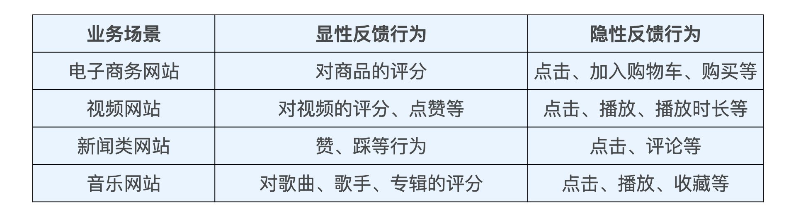
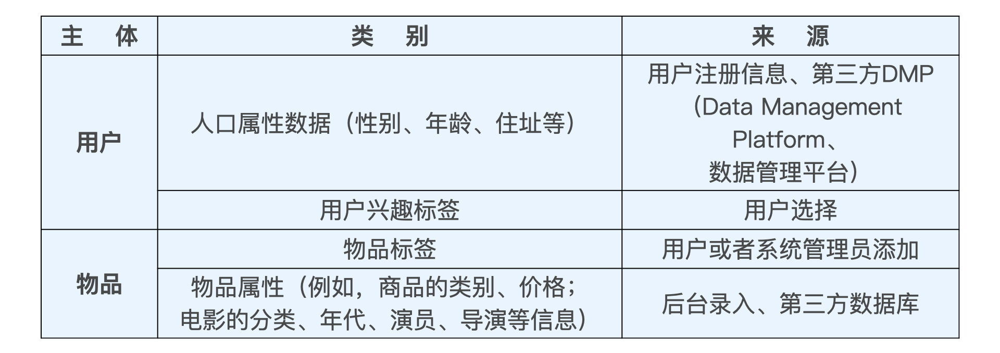

# 特征工程
- 1、什么是特征工程？
- 2、构建特征工程的基本原则是什么？
- 3、推荐系统中常用的特征有哪些？

## 特征工程定义
- 特征工程就是利用工程手段从“用户信息”“物品信息”“场景信息”中提取特征的过程。
- 难点
  - 1、数据多、且庞杂，怎么才能挑出那些对推荐有用的特征呢？
  - 2、不是数字的信息怎么处理成一个模型可用的数值向量呢？（从“推荐模型”的角度来说，一个机器学习模型的输入，往往是一个数值型的向量。）
- 特征其实是对某个行为过程相关信息的抽象表达。
  - why？（因为一个行为过程必须转换成某种数学形式才能被机器学习模型所学习，为了完成这种转换，我们就必须将这些行为过程中的信息以特征的形式抽取出来。）
- 信息损失
  - 从具体行为信息转化成抽象特征的过程，往往会造成信息的损失
    - 1、因为具体的推荐行为和场景中包含大量原始的场景、图片和状态信息，保存所有信息的存储空间过大，我们根本无法实现。
    - 2、因为具体的推荐场景中包含大量冗余的、无用的信息，把它们都考虑进来甚至会损害模型的泛化能力。
    
## 构建推荐系统特征工程的原则
- 尽可能地让特征工程抽取出的一组特征，能够保留推荐环境及用户行为过程中的所有“有用“信息，并且尽量摒弃冗余信息。
- 在已有的、可获得的数据基础上，“尽量”保留有用信息是现实中构建特征工程的原则。

## 常用的特征
- 1、用户行为数据 User Behavior Data
  - 用户行为在推荐系统中一般分为显性反馈行为（Explicit Feedback）和隐性反馈行为（Implicit Feedback）两种，在不同的业务场景中，它们会以不同的形式体现。
  - 对用户行为数据的使用往往涉及对业务的理解，不同的行为在抽取特征时的权重不同，而且一些跟业务特点强相关的用户行为需要推荐工程师通过自己的观察才能发现。
  - 在当前的推荐系统特征工程中，隐性反馈行为越来越重要，主要原因是显性反馈行为的收集难度过大，数据量小。在深度学习模型对数据量的要求越来越大的背景下，仅用显性反馈的数据不足以支持推荐系统训练过程的最终收敛。所以，能够反映用户行为特点的隐性反馈是目前特征挖掘的重点。

- 2、用户关系数据 User Relationship Data
  - 用户关系数据（User Relationship Data）就是人与人之间连接的记录。
  - 用户关系数据也可以分为“显性”和“隐性”两种，或者称为“强关系”和“弱关系”。
    - 用户与用户之间可以通过“关注”“好友关系”等连接建立“强关系”，也可以通过“互相点赞”“同处一个社区”，甚至“同看一部电影”建立“弱关系”。
  - 将用户关系作为召回层的一种物品召回方式；也可以通过用户关系建立关系图，使用 Graph Embedding 的方法生成用户和物品的 Embedding；还可以直接利用关系数据，通过“好友”的特征为用户添加新的属性特征；甚至可以利用用户关系数据直接建立社会化推荐系统。
- 3、属性 Attribute Data、标签Label Data 类数据
  - 本质上都是直接描述用户或者物品的特征。属性和标签的主体可以是用户，也可以是物品。它们的来源非常多样，大体上包含图 5 中的几类

  - 在推荐系统中使用属性、标签类数据，一般是通过 Multi-hot 编码的方式将其转换成特征向量，一些重要的属性标签类特征也可以先转换成 Embedding，比如业界最新的做法是将标签属性类数据与其描述主体一起构建成知识图谱（Knowledge Graph），在其上施以 Graph Embedding 或者 GNN（Graph Neural Network，图神经网络）生成各节点的 Embedding，再输入推荐模型。
- 4、内容类数据 Content Data
  - 内容类数据往往是大段的描述型文字、图片，甚至视频
  - 内容类数据无法直接转换成推荐系统可以“消化”的特征，需要通过自然语言处理、计算机视觉等技术手段提取关键内容特征，再输入推荐系统。
- 5、场景信息（上下文信息）Context Information
  - 描述推荐行为产生的场景的信息。
  - 最常用的上下文信息是“时间”和通过 GPS、IP 地址获得的“地点”信息。
  - 根据推荐场景的不同，上下文信息的范围极广，除了我们上面提到的时间和地点，还包括“当前所处推荐页面”“季节”“月份”“是否节假日”“天气”“空气质量”“社会大事件”等等。
  - 场景特征描述的是用户所处的客观的推荐环境，广义上来讲，任何影响用户决定的因素都可以当作是场景特征的一部分。但在实际的推荐系统应用中，由于一些特殊场景特征的获取极其困难，我们更多还是利用时间、地点、推荐页面这些易获取的场景特征。
### 难点
- 针对不同的推荐系统，我们也要针对它们的业务特点，因地制宜地挑选合适的特征，抓住业务场景中的关键信息。这才是特征工程中不变的准则，以及我们应该在工作中不断积累的业务经验。

## 案例
- 如果你是一名音乐 App 的用户，你觉得在选歌的时候，有哪些信息是影响你做决定的关键信息？那如果再站在音乐 App 工程师的角度，你觉得有哪些关键信息是可以被用来提取特征的，哪些是很难被工程化的？
音乐App
1.影响我做决定的关键信息：
A. 个人主观角度
a.不同时间段【起床刷牙、工作时间、跑步时间、洗漱时间、睡前时间】 喜欢的类型不同
b.地理位置【寝室、办公室、室外、健身房】， 对应不同的状态
c. 心情/ 情绪状态 【 不同情绪状态 会 持续 听 不同类型 的歌曲】
B. 客观角度
a. 最近热议的 新歌 【流行度】
b. 最近热议的电影 的主题曲 【流行度】
c. 朋友最近在听的歌曲【用户关系】
d. 热门歌曲【我自己个人对这类歌曲喜好度偏低】
e. 所在地区大部分人都喜欢的歌曲

作为音乐App工程师的角度的特征
A. 易被工程化：
a. 不同时间段 喜欢的 音乐
b. 不同地理位置 喜欢的音乐
c. 热门歌曲【当地热门，全球热门，中国地区热门】
e. 基于社交网络的歌曲推荐【基于用户的协同过滤、基于好友关系的推荐】
B. 不易被工程化：
心情/情绪【或许可以尝试短期内在听歌曲类型去提取？】

特征方面：
用户交互特征: 点击、收藏、点赞、踩、评分、评论【好/坏】、转发、播放完成度、浏览评论时长
用户属性特征：年龄、性别、职业、收入范围、所在地区、地理位置、不同时间段对各音乐类型的偏好度、不同地理位置对音乐类型的偏好度
用户关系特征：好友关系、亲密好友关系、有相同爱好的人群【基于用户协同过滤top K得出】
场景特征：用户当前所处位置、用户当前状态【用户自行设置？】、当前时间段、是否工作日、是否周末、是否节假日、
音乐特征：是否优质音乐【评分】、音乐风格、音乐时长、歌手、专辑、发行年月、所属标签、流行度、被重复播放的中位数

思考：
特征的更新频率：
用户：分为长中短期用户画像、仅保存三个月内活跃过的用户的画像以减少存储？
音乐：流行度需要按日期更新、热门程度也可能需要跟节假日相关【圣诞节=》圣诞结】