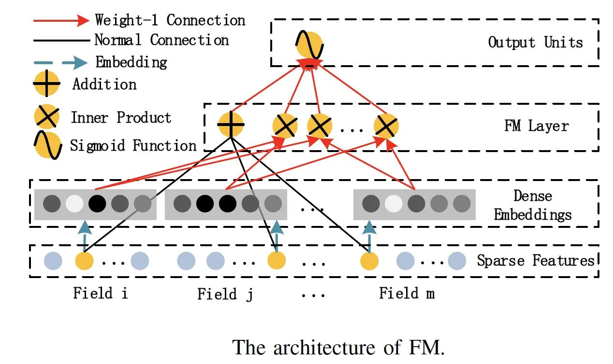
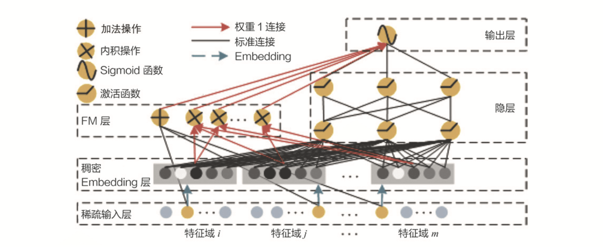
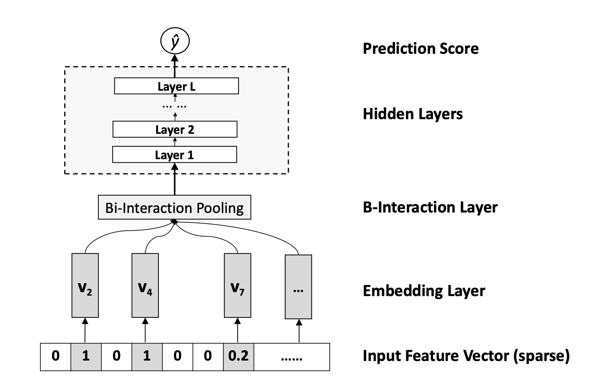

# DeepFM
- 特征组合和特征交叉问题非常常见，而且在实际应用中，特征的种类还要多得多，特征交叉的复杂程度也要大得多。解决这类问题的关键，就是模型对于特征组合和特征交叉的学习能力，因为它决定了模型对于未知特征组合样本的预测能力，而这对于复杂的推荐问题来说，是决定其推荐效果的关键点之一。
- MLP 有拟合任意函数的能力，但这是建立在 MLP 有任意多层网络，以及任意多个神经元的前提下的。
- 在训练资源有限，调参时间有限的现实情况下，MLP 对于特征交叉的处理其实还比较低效。因为 MLP 是通过 concatenate 层把所有特征连接在一起成为一个特征向量的，这里面没有特征交叉，两两特征之间没有发生任何关系。

## 因子分解机模型（Factorization Machine）

## DeepFM模型架构图

- DeepFM 是由哈工大和华为公司联合提出的深度学习模型
- DeepFM 利用了 Wide&Deep 组合模型的思想，用 FM 替换了 Wide&Deep 左边的 Wide 部分，加强了浅层网络部分特征组合的能力，而右边的部分跟 Wide&Deep 的 Deep 部分一样，主要利用多层神经网络进行所有特征的深层处理，最后的输出层是把 FM 部分的输出和 Deep 部分的输出综合起来，产生最后的预估结果。这就是 DeepFM 的结构。

## NFM

- Bi-Interaction Pooling Layer 翻译成中文就是“两两特征交叉池化层”