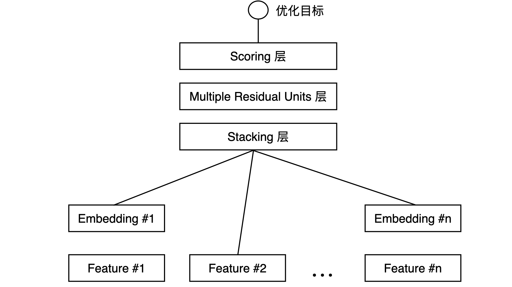

# Embedding+MLP
- MLP: Multilayer perceptron，多层感知机的缩写。感知机是神经元的另外一种叫法，所以多层感知机就是多层神经网络。

## Deep Crossing
- 微软在 2016 年提出的深度学习模型,用于广告推荐这个业务场景上。它是一个经典的 Embedding+MLP 模型结构
- Deep Crossing 从下到上可以分为 5 层，分别是 Feature 层、Embedding 层、Stacking 层、MLP 层和 Scoring 层。

  - Feature 层也叫做输入特征层，它处于 Deep Crossing 的最底部，作为整个模型的输入。
    - Feature#1 向上连接到了 Embedding 层，而 Feature#2 就直接连接到了更上方的 Stacking 层。为什么？
      - Feature#1 代表的是类别型特征经过 One-hot 编码后生成的特征向量，而 Feature#2 代表的是数值型特征。
      - One-hot 特征太稀疏了，不适合直接输入到后续的神经网络中进行训练，所以我们需要通过连接到 Embedding 层的方式，把这个稀疏的 One-hot 向量转换成比较稠密的 Embedding 向量。
  - Embedding 层就是为了把稀疏的 One-hot 向量转换成稠密的 Embedding 向量而设置的，我们需要注意的是，Embedding 层并不是全部连接起来的，而是每一个特征对应一个 Embedding 层，不同 Embedding 层之间互不干涉。
    - Embeding 层的结构就是 Word2vec 模型中从输入神经元到隐层神经元的部分
  - Stacking 层中文名是堆叠层，我们也经常叫它连接（Concatenate）层。它的作用比较简单，就是把不同的 Embedding 特征和数值型特征拼接在一起，形成新的包含全部特征的特征向量。
  - MLP 层就是我们开头提到的多层神经网络层，在图中指的是 Multiple Residual Units 层，中文叫多层残差网络。
    - 微软在实现 Deep Crossing 时针对特定的问题选择了残差神经元
    - 神经元的选择有非常多种，比如Sigmoid、tanh、ReLU等，ReLU 最经常使用在隐层神经元上，Sigmoid 则多使用在输出神经元
    - 实践中也可以选择性地尝试其他神经元，根据效果作出最后的决定。
    - MLP 层的特点是全连接，就是不同层的神经元两两之间都有连接。
    - MLP 层的作用是让特征向量不同维度之间做充分的交叉，让模型能够抓取到更多的非线性特征和组合特征的信息，这就使深度学习模型在表达能力上较传统机器学习模型大为增强。
  - Scoring 层，它也被称为输出层。虽然深度学习模型的结构可以非常复杂，但最终我们要预测的目标就是一个分类的概率。
    - 点击率预估，就是一个二分类问题，那我们就可以采用逻辑回归作为输出层神经元
    - 图像分类这样的多分类问题，往往在输出层采用 softmax 这样的多分类模型。
- 总结：对于类别特征，先利用 Embedding 层进行特征稠密化，再利用 Stacking 层连接其他特征，输入 MLP 的多层结构，最后用 Scoring 层预估结果。

## 构建推荐模型的步骤
- 特征选择
- 模型设计
- 模型实现
- 模型训练
- 模型评估

## Embedding+MLP 模型的 TensorFlow 实现
