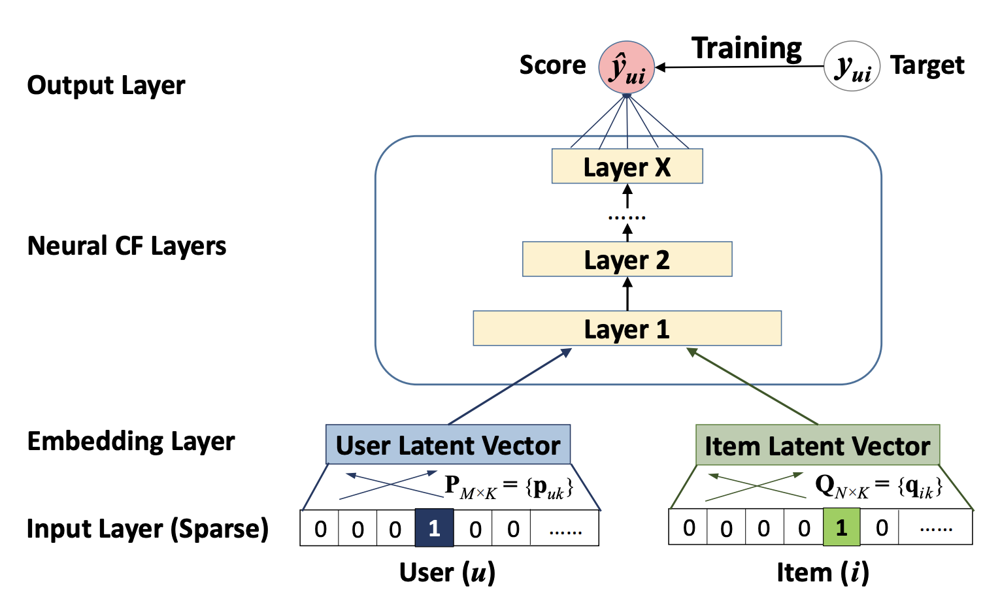
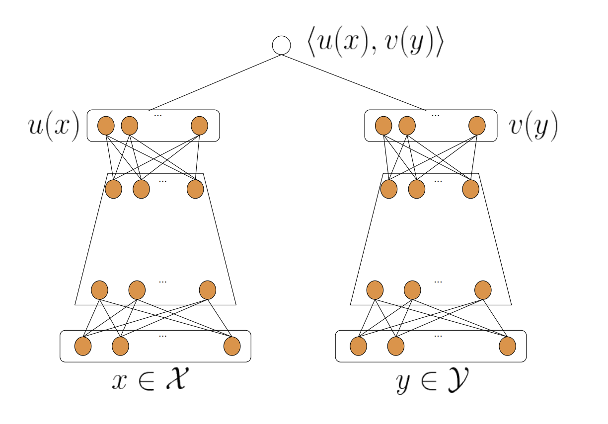

# NeuralCF
- 2017 年，新加坡国立的研究者就使用深度学习网络来改进了传统的协同过滤算法，取名 NeuralCF（神经网络协同过滤）
- NeuralCF 大大提高了协同过滤算法的泛化能力和拟合能力，让这个经典的推荐算法又重新在深度学习时代焕发生机。

## 协同过滤
- 缺点：它是通过直接利用非常稀疏的共现矩阵进行预测的，所以模型的泛化能力非常弱，遇到历史行为非常少的用户，就没法产生准确的推荐结果了。

## 矩阵分解
- 缺点：通过矩阵分解算法增强它的泛化能力，但因为矩阵分解是利用非常简单的内积方式来处理用户向量和物品向量的交叉问题的，所以，它的拟合能力也比较弱。

## 模型结构图

- NeuralCF 用一个多层的神经网络替代掉了原来简单的点积操作。这样就可以让用户和物品隐向量之间进行充分的交叉，提高模型整体的拟合能力。

## 双塔模型

- 双塔模型最重要的优势就在于它易上线、易服务。为什么这么说呢？
  - 双塔模型最大的优势在于模型服务的便捷性，由于最终的互操作层是简单的内积操作或浅层神经网络。因此，我们可以把物品塔的输出当作物品 Embedding，用户塔的输出当作用户 Embedding 存入特征数据库，在线上只要实现简单的互操作过程就可以了。
- 