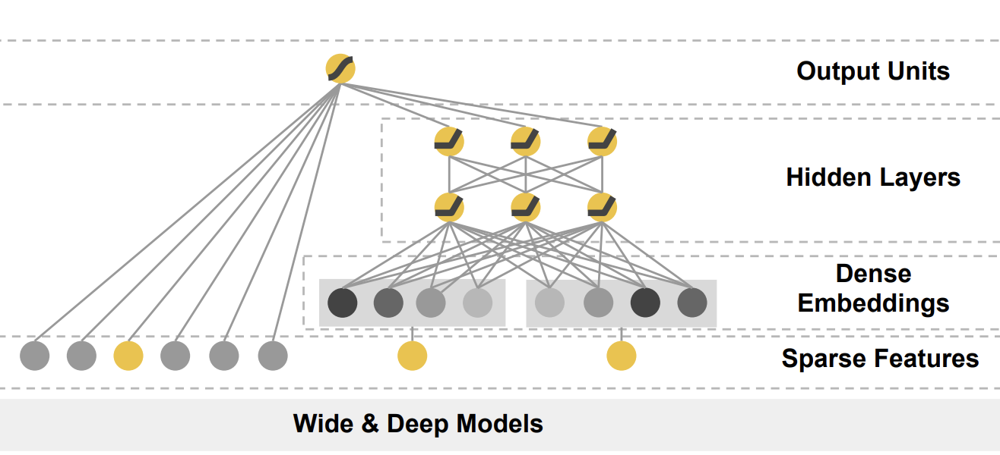
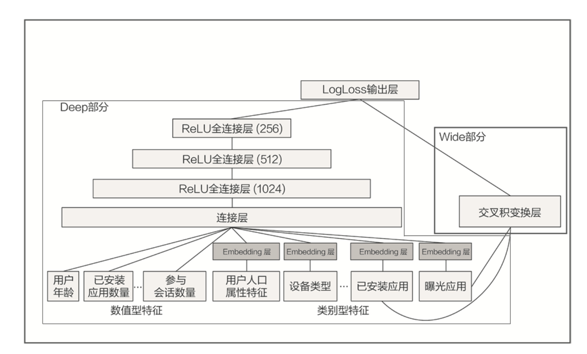

# Wide&Deep
- Wide&Deep 模型是由 Google 的应用商店团队 Google Play 提出的，在 Google Play 为用户推荐 APP 这样的应用场景下
- Wide&Deep 模型的结构图

  - 它是由左侧的 Wide 部分和右侧的 Deep 部分组成的。
  - Wide 部分的结构太简单了，就是把输入层直接连接到输出层，中间没有做任何处理。
  - Deep 层的结构稍复杂
## Google 为什么要创造这样一个混合式的模型结构呢？
Wide 部分的主要作用是让模型具有较强的“记忆能力”（Memorization），而 Deep 部分的主要作用是让模型具有“泛化能力”（Generalization），因为只有这样的结构特点，才能让模型兼具逻辑回归和深度神经网络的优点，也就是既能快速处理和记忆大量历史行为特征，又具有强大的表达能力，这就是 Google 提出这个模型的动机。

## 模型的记忆能力
- 所谓的 “记忆能力”，可以被宽泛地理解为模型直接学习历史数据中物品或者特征的“共现频率”，并且把它们直接作为推荐依据的能力 。
  - 电影推荐中可以发现一系列的规则，比如，看了 A 电影的用户经常喜欢看电影 B，这种“因为 A 所以 B”式的规则，非常直接也非常有价值。
- 规则有两个特点
  - 一是数量非常多，一个“记性不好”的推荐模型很难把它们都记住；
  - 二是没办法推而广之，因为这类规则非常具体，没办法或者说也没必要跟其他特征做进一步的组合。
    - 看了电影 A 的用户 80% 都喜欢看电影 B，这个特征已经非常强了，我们就没必要把它跟其他特征再组合在一起。
- 为什么模型要有 Wide 部分？
  - Wide 部分可以增强模型的记忆能力，让模型记住大量的直接且重要的规则，这正是单层的线性模型所擅长的。

## 模型的泛化能力
- “泛化能力”指的是模型对于新鲜样本、以及从未出现过的特征组合的预测能力。
  - 模型有了很强的泛化能力之后，才能够对一些非常稀疏的，甚至从未出现过的情况作出尽量“靠谱”的预测。
  - 矩阵分解算法，就是为了解决协同过滤“泛化能力”不强而诞生的。因为协同过滤只会“死板”地使用用户的原始行为特征，而矩阵分解因为生成了用户和物品的隐向量，所以就可以计算任意两个用户和物品之间的相似度了。这就是泛化能力强的另一个例子。

## Wide&Deep Google 场景
Wide&Deep 通过组合 Wide 部分的线性模型和 Deep 部分的深度网络，取各自所长，就能得到一个综合能力更强的组合模型。
