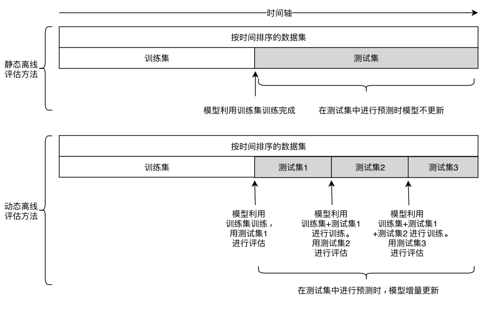

# 离线评估
- 离线评估的基本原理是在离线环境下，将数据集分为“训练集”和“测试集”两部分，“训练集”用来训练模型，“测试集”用于评估模型。

## 常用的离线评估方法
- Holdout 检验
  - Holdout 检验是最基础，最常用的离线评估方法，它将原始的样本集合随机划分为训练集和测试集两部分，所以 Holdout 检验的关键词就是“随机”。
  - 优缺点：Holdout 检验很简单实用，但它的缺点也很明显，就是评估的结果有一定随机性，因为训练集和验证集的划分是随机的，所以如果只进行少量的 Holdout 检验，得到的评估指标会存在一定的波动。
- 交叉检验
  - 先将全部样本划分成 k 个大小相等的样本子集，然后依次遍历这 k 个子集，每次把当前遍历到的子集作为验证集，其余所有的子集作为训练集，这样依次进行 k 次模型的训练和评估。最后，我们再将所有 k 次评估指标的平均值作为最终的评估指标。在我们的实践中，k 经常取 10，也就是依次进行 10 次检验然后取指标均值。
- 自助法
  - 自助法（Bootstrap）是基于自助采样的检验方法，它的主要过程是：对于总数为 n 的样本集合，我们先进行 n 次有放回地随机抽样，得到大小为 n 的训练集。在 n 次采样过程中，有的样本会被重复采样，有的样本没有被抽出过，我们再将这些没有被抽出的样本作为验证集进行模型验证，这就是自助法的验证过程。
  - 缺点：它其实改变了原有数据的分布，有可能让模型产生一定程度的偏差。
- 时间切割
  - 缺点：整个评估过程是静态的，模型不会随着评估的进行而更新
- 离线 Replay。
  - 在离线状态下对线上更新过程进行仿真，让整个评估过程“动”起来。业界把这样离线仿真式的评估方式叫做离线 Replay。
  - 缺点：需要在评估过程中不断更新模型，这让评估过程的工程实现难度加大，因为包含了模型训练的时间，所以整个评估过程的总时长也会加长，影响评估和调参的效率。

## Q&A
- 离线 Replay 这个方法，跟我们之前讲过的增强学习有什么相似之处吗？你知道它们两个还有什么更深层次的关系吗？
  - 离线Replay和RL都是动态更新模型的，都需要不断的测试和再训练模型。增强学习(如DRN)是通过不断接受反馈，在线更新模型的，所以评估方法不能引入未来信息，而简单的时间切割评估方法又不能模拟模型的更新频率，所以离线Replay是增强学习的唯一离线评估方法。