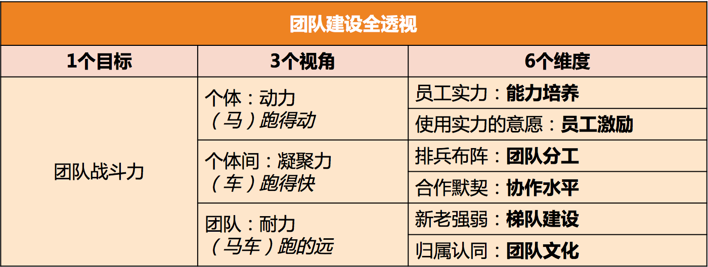

# 个人职业规划
- 从简历询问你每一次跳槽的初衷
- 
# 团队管理
## 如何激励团队

## 团队任务如何拆分

## 团队建设如何做

## 团队OKR如何设定

## 如何群策群力打胜仗？
- “群策群力”就是如何带好团队，“打胜仗”就是如何取得好的业绩，“带人”+“做事”，齐了。“群策群力”是终极目标
- 你希望通过解决或改善什么问题，来更好地实现‘群策群力打胜仗’这个目标呢？
- 管理者的三项日常工作：“管理规划”“团队建设”和“任务管理”，用通俗的话来说，就是“看方向”“带人”和“做事”。

## 团队建设入手点

## 如何提升员工的个人能力？
- 你要提升员工的什么能力？