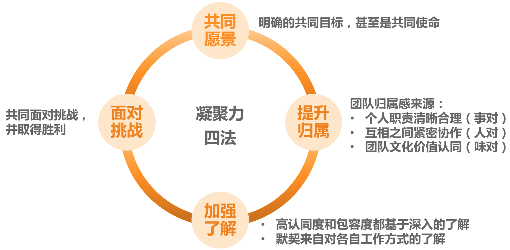

# 有什么方法可以有效提升团队凝聚力吗？
- 为了达到团队成员间的良好合作，分工明确就足够了吗？
  - 分工明确只是具备了合作的前提和基础，真正能够让大家良好互动并高效产出的，是日常工作中的协作。
- 何为良好的协作呢？
  - 协作水平很高的团队，就好像一部良好运转的机器一样，既有分工，又彼此紧密连接，形成一个有机整体。

## 该如何不断提升团队的协作水平呢？
- 第一个角度是建立协作机制，通过机制来约定协作的动作，以此来保证大家“动作协调”。
- 第二个视角是提升团队凝聚力，通过提升团队成员间的信任度、认同度和默契度来降低协作成本，提高协作效率。
** 团队凝聚力更侧重团队成员间的关系，体现他们的信任度和向心力如何；而协作水平则更关注做事过程中的互动情况。**

## 如何来提升团队凝聚力呢？
- 第一个角度，设立共同愿景。
  - 要求团队首先要有一个使命和愿景，有一个共同的长远目标
  - 设定步骤
    - 1、明确你团队的职责、使命和工作目标。这里的工作目标是长远的共同目标。
    - 2、管理者自己要笃信第 1 条的内容。如果不笃信，就返回步骤 1 继续提炼。
    - 3、在各种合适的场合宣贯这一内容，比如季度会、总结会、沟通会、启动会，以及 1 对 1 沟通等，都要不失时机、不突兀地把使命和愿景同步给大家。
    - 4、坚持不懈地做步骤 3。不要指望一蹴而就，开个会大家就都认同了的好事，现实中不会发生，只有时间长了、频次够了，才会内化，才会深深植入员工的内心。
- 第二个角度，提升员工归属
  - 如果说，设立共同的愿景，是为了让员工凝聚到共同的事业上的话，那么提升员工归属感，则是为了让员工凝聚到团队上，让员工从心里就认为自己是团队的一份子。那么，如何才能让员工有这种感觉呢？主要从以下三个层次来做：
    - 1、要给他一个位置，给他一个“立足之地”，也就是要分给他一份职责。
      - 职责并不总是意味着压力，也意味着归属，人的内心深处是渴望承担适当的责任的。只有当员工清楚自己能为团队做出什么贡献的时候，才会心安，才会感受到自己是团队的一份子。所以在团队分工上，要让员工清楚他肩负的职责对于团队的意义，让他觉得自己做的事有价值，这就是所谓的“事对”。
    - 2、要营造良好的团队人际关系，让彼此间形成紧密的连接。
      - 团队成员间良好的关系，和团队凝聚力的提升是互为因果的，所以不要小看能促进员工间关系的一些小事，恰恰是这些小事，能够促使员工间的合作关系走上正向循环的轨道，员工会因为喜欢和团队的人相处而觉得有归属感。这就是所谓的“人对”。
    - 3、明确亮出团队的文化价值观。
      - 团队的文化和价值观是否是员工认同和欣赏的，决定了他能否长期留在团队。价值观方面的冲突是很难调和的，如果员工从价值观层面就不认同团队，是很难让他找到归属感的。好在团队文化本身就是一个筛选器，最终留在团队发挥核心作用的都会是认同团队价值观的人，当然前提是团队先有明确的价值取向。
      - 因喜欢一个团队的文化和氛围而产生归属感，这就是所谓的“味对”。
    - 如果一个团队能让员工觉得“事对”“人对”“味对”，那么，他的归属感应该是很强的。
- 第三个角度，加强相互了解。
- 第四个角度，共同面对挑战。
  - 经典台词：今日谁与我共同浴血，他就是我的兄弟
  - 案例
    - 一些有挑战的大型项目或紧急事故的应对。
    - 跨团队的对抗性活动，比如趣味运动会、Dota 比赛等。
